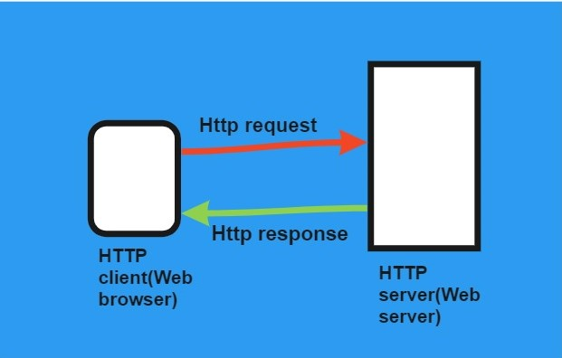

# Movies_Library

# Movies-Library -  Version 1001001

**Author Name**: Hamza Ahmad rasheed Hazaimeh

## WRRC

## Overview
movie server to display the best movie 
## Getting Started
Task 11: 
- Clone the repositry 
- Instal npm test and express.
- Open it with VS Code.
- Reseve the data from data.json}
- Use Postman to check the url

Task12:
-instead of reading from json file we send request to third party API
-create Api key
-we install Axios to send Http request to the api 
-ceate .env and add the api key 

Task13:

-we make database
-make end point to get all element and insert data 

Task 14:
we build end point to get , update , delete specific element from database

## Project Features
we use anew tool to build it
